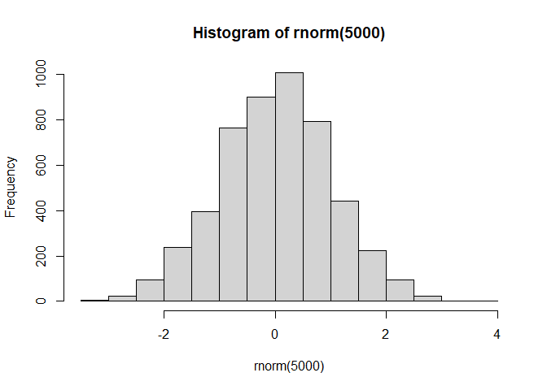
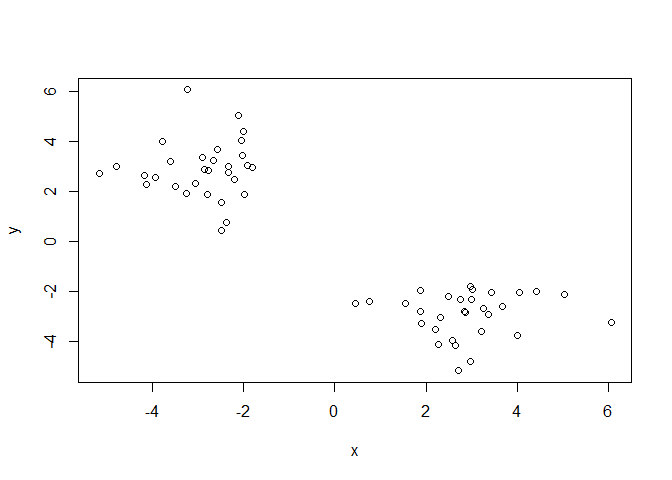
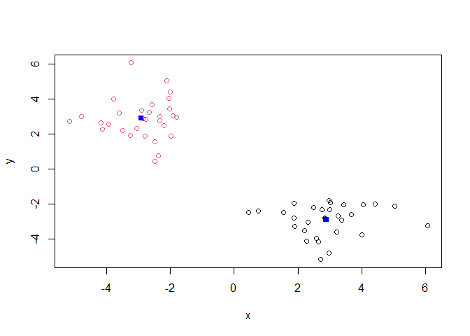
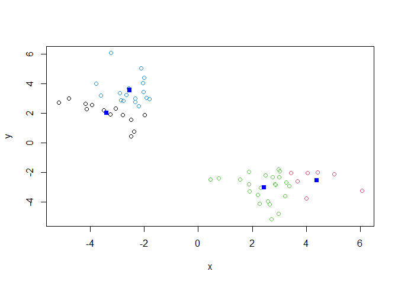
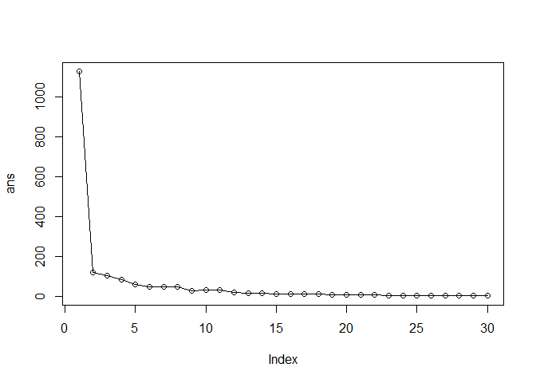
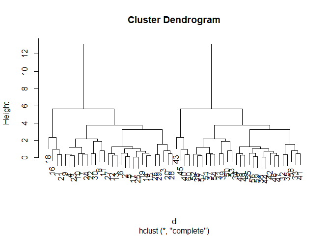
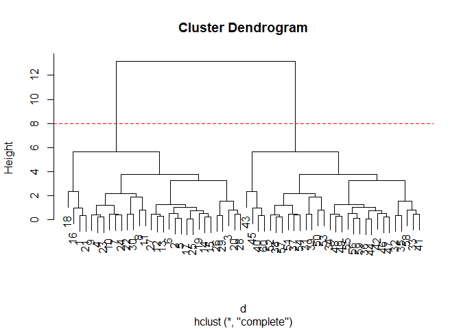
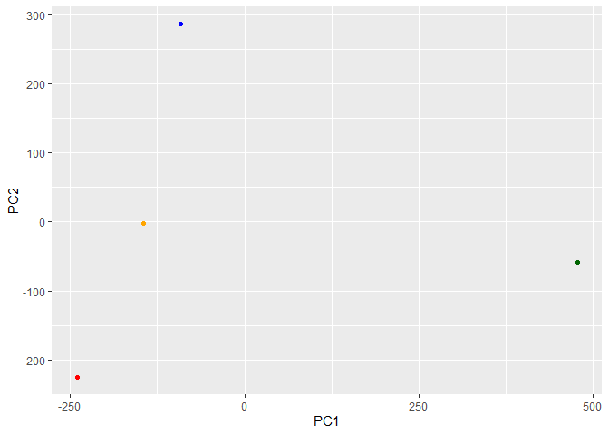
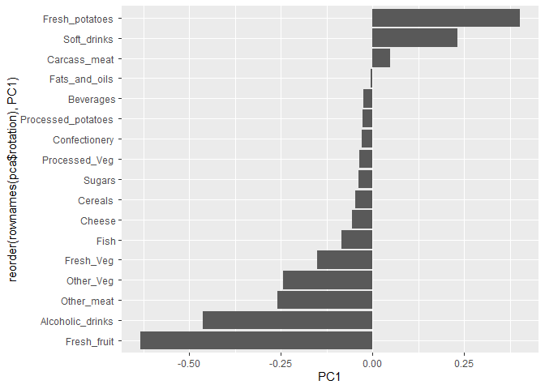

# Class 7: Machine Learning 1
Aadhya Tripathi (PID: A17878439)

- [Background](#background)
- [K-means clustering](#k-means-clustering)
- [Hierarchical Clustering](#hierarchical-clustering)
- [PCA of UK food data](#pca-of-uk-food-data)
  - [Spotting major differences and
    trends](#spotting-major-differences-and-trends)
  - [Pairs plots and heatmaps](#pairs-plots-and-heatmaps)
- [PCA to the Rescue](#pca-to-the-rescue)

## Background

Today we will begin our exploration of some important machine learning
methods, namely **clustering** and **dimensionality reduction**.

Let’s make up some input data for clustering where we know what the
natural “clusters” are.

The function `rnorm()` can be useful here.

``` r
hist(rnorm(5000))
```



> Q. Generate 30 random numbers centered at +3, and another 30 centered
> at -3.

``` r
tmp <- c(rnorm(30, mean = 3),
         rnorm(30, mean = -3))
x <- cbind(x=tmp, y=rev(tmp))
plot(x)
```



``` r
# rev - reverses vector order (ex. A to Z becomes Z to A)
# cbind - combines two vectors into two columns
```

## K-means clustering

The main function in “base R” for K-means clustering is called
`kmeans()`:

``` r
km <- kmeans(x, centers=2)
km
```

    K-means clustering with 2 clusters of sizes 30, 30

    Cluster means:
              x         y
    1  2.887707 -2.901461
    2 -2.901461  2.887707

    Clustering vector:
     [1] 1 1 1 1 1 1 1 1 1 1 1 1 1 1 1 1 1 1 1 1 1 1 1 1 1 1 1 1 1 1 2 2 2 2 2 2 2 2
    [39] 2 2 2 2 2 2 2 2 2 2 2 2 2 2 2 2 2 2 2 2 2 2

    Within cluster sum of squares by cluster:
    [1] 60.29277 60.29277
     (between_SS / total_SS =  89.3 %)

    Available components:

    [1] "cluster"      "centers"      "totss"        "withinss"     "tot.withinss"
    [6] "betweenss"    "size"         "iter"         "ifault"      

> Q. What components of the results object details the cluster sizes?

``` r
km$size
```

    [1] 30 30

> Q. What components of the results object details the cluster centers?

``` r
km$centers
```

              x         y
    1  2.887707 -2.901461
    2 -2.901461  2.887707

> Q. What components of the results object details the cluster
> membership vector (the main results of which points lie in which
> cluster)?

``` r
km$cluster
```

     [1] 1 1 1 1 1 1 1 1 1 1 1 1 1 1 1 1 1 1 1 1 1 1 1 1 1 1 1 1 1 1 2 2 2 2 2 2 2 2
    [39] 2 2 2 2 2 2 2 2 2 2 2 2 2 2 2 2 2 2 2 2 2 2

> Q. Plot our clustering results with points colored by cluster
> membership. Also add the cluster centers as new points colored blue.

``` r
plot(x, col=km$cluster)
points(km$centers, col="blue", pch=15)
```



> Q. Run `kmeans()` again and this time produce 4 clusters. Call your
> result object `k4`.

``` r
k4 <- kmeans(x, centers=4)
k4$cluster
```

     [1] 2 3 3 3 3 2 3 3 3 3 2 3 3 3 3 2 3 2 3 3 2 3 3 3 3 3 2 3 3 3 1 1 1 4 1 4 1 1
    [39] 1 4 1 4 4 4 4 4 4 4 4 4 1 1 4 1 4 4 1 1 4 4

``` r
plot(x, col=k4$cluster)
points(k4$centers, col="blue", pch=15)
```



The metric

``` r
km$tot.withinss
```

    [1] 120.5855

``` r
k4$tot.withinss
```

    [1] 76.12993

> Q. Let’s try different number of k (centers) from 1 to 30 and see what
> the best result is.

``` r
ans <- NULL
for(i in 1:30) {
  ans <- c(ans, kmeans(x, centers=i)$tot.withinss)
}
```

``` r
plot(ans, typ="o")
```



**Note:** K-means will apply a clustering structure that you specify,
even if it is not supported by the data. i.e. It will give you what you
ask for. A scree plot can show the point where the slope changes sharply
is the most “effective”(?) value for k

## Hierarchical Clustering

The main function for Hierarchical clustering is called `hclust()`.

Unlike `kmeans()` (which does everything for you), you cannot just pass
your raw input data into `hclust()`. It needs a distance matrix, like
the one returned by the `dist()` function.

``` r
d <- dist(x)
hc <- hclust(d)
plot(hc)
```



To extract our cluster membership vector from an `hclust()` result
object we have to “cut” our tree at a given height to yield separate
“groups”/“branches”.

``` r
plot(hc)
abline(h=8, col="red", lty=2)
```



To do this, we use the `cutree()` function on our `hclust()` object.

``` r
grps <- cutree(hc, h=8)
grps
```

     [1] 1 1 1 1 1 1 1 1 1 1 1 1 1 1 1 1 1 1 1 1 1 1 1 1 1 1 1 1 1 1 2 2 2 2 2 2 2 2
    [39] 2 2 2 2 2 2 2 2 2 2 2 2 2 2 2 2 2 2 2 2 2 2

``` r
table(grps, km$cluster)
```

        
    grps  1  2
       1 30  0
       2  0 30

## PCA of UK food data

Import the datasets on food consumption in the UK

``` r
url <- "https://tinyurl.com/UK-foods"
x <- read.csv(url)
x
```

                         X England Wales Scotland N.Ireland
    1               Cheese     105   103      103        66
    2        Carcass_meat      245   227      242       267
    3          Other_meat      685   803      750       586
    4                 Fish     147   160      122        93
    5       Fats_and_oils      193   235      184       209
    6               Sugars     156   175      147       139
    7      Fresh_potatoes      720   874      566      1033
    8           Fresh_Veg      253   265      171       143
    9           Other_Veg      488   570      418       355
    10 Processed_potatoes      198   203      220       187
    11      Processed_Veg      360   365      337       334
    12        Fresh_fruit     1102  1137      957       674
    13            Cereals     1472  1582     1462      1494
    14           Beverages      57    73       53        47
    15        Soft_drinks     1374  1256     1572      1506
    16   Alcoholic_drinks      375   475      458       135
    17      Confectionery       54    64       62        41

> Q1. How many rows and columns are in your new data frame named x? What
> R functions could you use to answer this questions?

``` r
dim(x)
```

    [1] 17  5

One solution to set the row names is to do it by hand, one by one.

``` r
rownames(x) <- x[,1]
x <- x[,-1]
head(x)
```

                   England Wales Scotland N.Ireland
    Cheese             105   103      103        66
    Carcass_meat       245   227      242       267
    Other_meat         685   803      750       586
    Fish               147   160      122        93
    Fats_and_oils      193   235      184       209
    Sugars             156   175      147       139

``` r
dim(x)
```

    [1] 17  4

A better way to do this is to set the row names to the first column with
`read.csv()`

``` r
x <- read.csv(url, row.names=1)
x
```

                        England Wales Scotland N.Ireland
    Cheese                  105   103      103        66
    Carcass_meat            245   227      242       267
    Other_meat              685   803      750       586
    Fish                    147   160      122        93
    Fats_and_oils           193   235      184       209
    Sugars                  156   175      147       139
    Fresh_potatoes          720   874      566      1033
    Fresh_Veg               253   265      171       143
    Other_Veg               488   570      418       355
    Processed_potatoes      198   203      220       187
    Processed_Veg           360   365      337       334
    Fresh_fruit            1102  1137      957       674
    Cereals                1472  1582     1462      1494
    Beverages                57    73       53        47
    Soft_drinks            1374  1256     1572      1506
    Alcoholic_drinks        375   475      458       135
    Confectionery            54    64       62        41

> Q2. Which approach to solving the ‘row-names problem’ mentioned above
> do you prefer and why? Is one approach more robust than another under
> certain circumstances?

The second, using `read.csv()` directly. The first approach will delete
a column everyone time the code is run.

### Spotting major differences and trends

It is difficult to see, even for a small 17D dataset

``` r
barplot(as.matrix(x), beside=T, col=rainbow(nrow(x)))
```


### Pairs plots and heatmaps

``` r
pairs(x, col=rainbow(nrow(x)), pch=16)
```


``` r
library(pheatmap)
pheatmap( as.matrix(x) )
```


## PCA to the Rescue

The main PCA function in “base R” is called `prcomp()`. This function
wants the transpose of our food data as input (i.e. the foods as
columns, and the countries as rows)

``` r
pca <- prcomp(t(x))
```

``` r
summary(pca)
```

    Importance of components:
                                PC1      PC2      PC3       PC4
    Standard deviation     324.1502 212.7478 73.87622 3.176e-14
    Proportion of Variance   0.6744   0.2905  0.03503 0.000e+00
    Cumulative Proportion    0.6744   0.9650  1.00000 1.000e+00

``` r
attributes(pca)
```

    $names
    [1] "sdev"     "rotation" "center"   "scale"    "x"       

    $class
    [1] "prcomp"

To make one of our main PCA result figures, we use `pca$x`for the scores
along our new principal components (PCs). This is called “PC plot” or
“score plot” or “ordination plot”.

``` r
pca$x
```

                     PC1         PC2        PC3           PC4
    England   -144.99315   -2.532999 105.768945 -4.894696e-14
    Wales     -240.52915 -224.646925 -56.475555  5.700024e-13
    Scotland   -91.86934  286.081786 -44.415495 -7.460785e-13
    N.Ireland  477.39164  -58.901862  -4.877895  2.321303e-13

``` r
my_cols <- c("orange", "red", "blue", "darkgreen")
```

``` r
library(ggplot2)

ggplot(pca$x) +
  aes(PC1, PC2) +
  geom_point(col=my_cols)
```



The second major result figure is called a “loadings plot”, or “variable
contributions plot”, or “weight plot”.

``` r
ggplot(pca$rotation) +
  aes(x = PC1, y = reorder(rownames(pca$rotation), PC1)) +
  geom_col()
```


