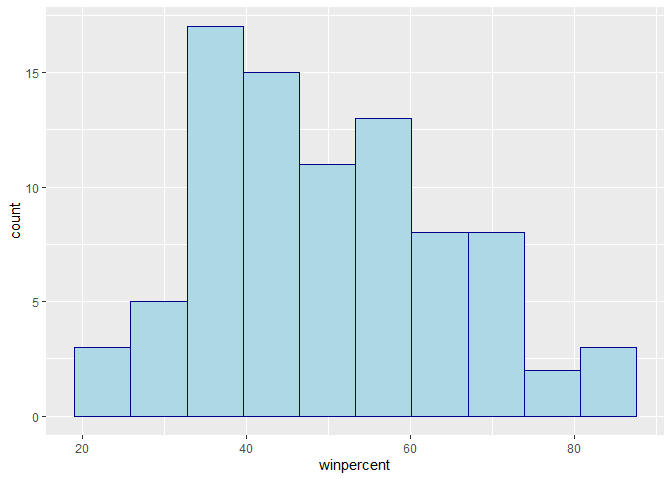
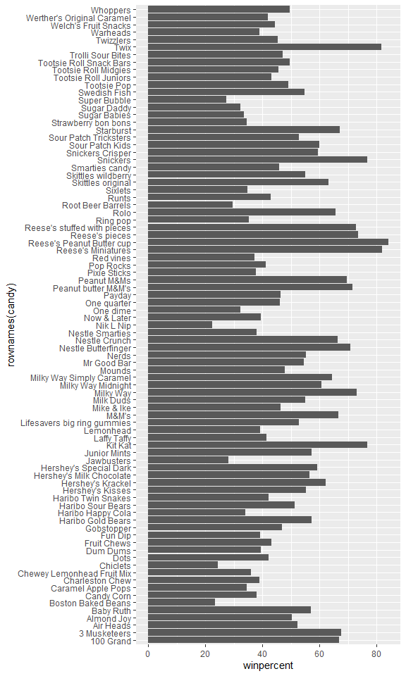
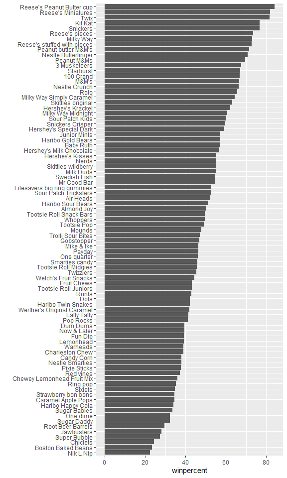
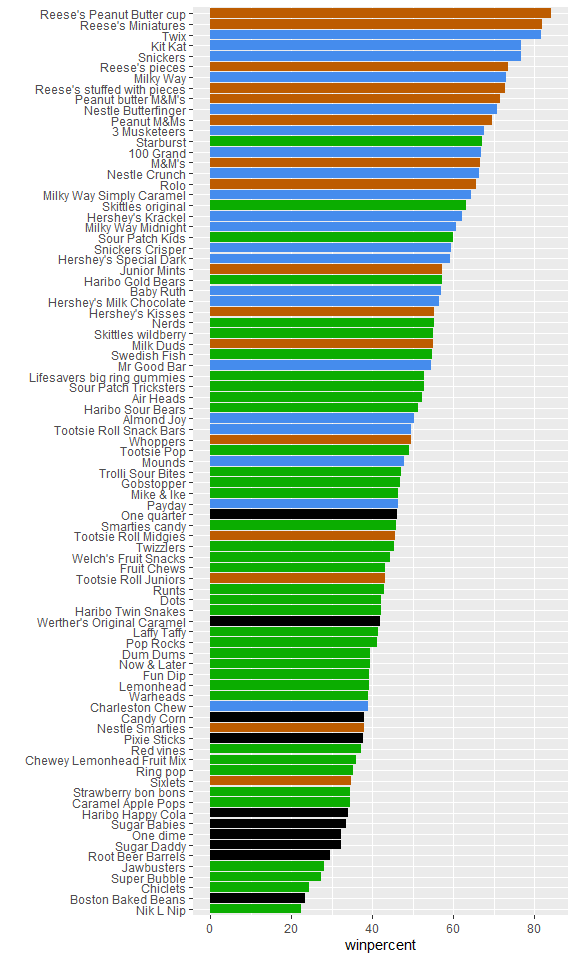
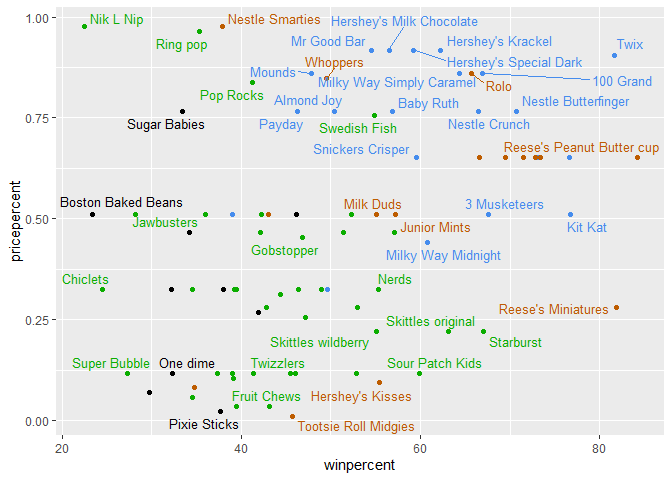
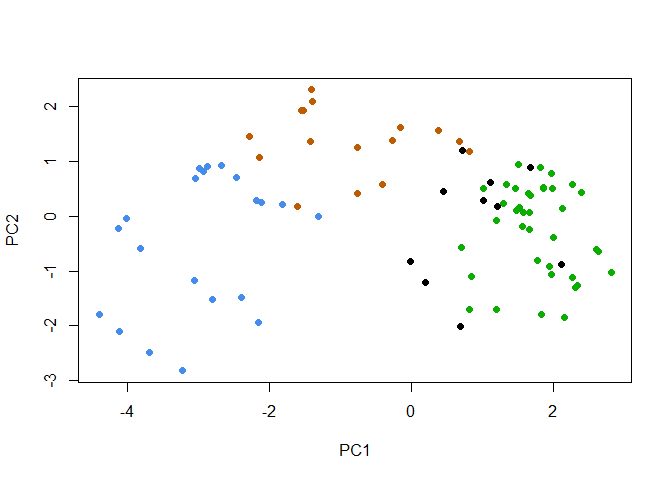
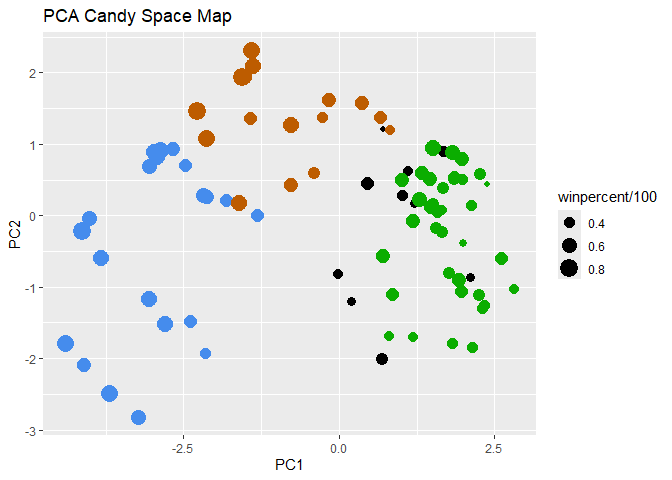
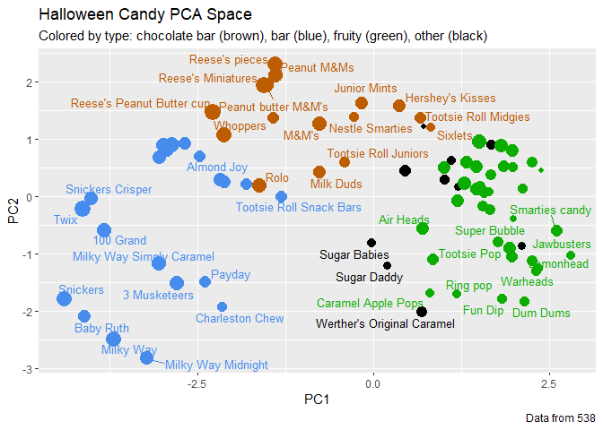

# Class 9: Candy Mini-Project
Aadhya Tripathi (PID: A17878439)

- [Background](#background)
- [Data Import](#data-import)
- [Exploratory analysis](#exploratory-analysis)
- [Overall Candy Rankings](#overall-candy-rankings)
- [Taking a look at pricepercent](#taking-a-look-at-pricepercent)
- [Exploring the correlation
  structure](#exploring-the-correlation-structure)
- [Principal Component Analysis](#principal-component-analysis)
- [Summary](#summary)

## Background

In today’s mini-project we will analyze candy data with exploratory
graphics, ggplot, basic statistics, correlation analysis, and principal
component analysis methods we have been learning.

## Data Import

The data comes as a CSV file from FiveThirtyEight.

``` r
candy <- read.csv("candy-data.csv", row.names = 1)
head(candy)
```

                 chocolate fruity caramel peanutyalmondy nougat crispedricewafer
    100 Grand            1      0       1              0      0                1
    3 Musketeers         1      0       0              0      1                0
    One dime             0      0       0              0      0                0
    One quarter          0      0       0              0      0                0
    Air Heads            0      1       0              0      0                0
    Almond Joy           1      0       0              1      0                0
                 hard bar pluribus sugarpercent pricepercent winpercent
    100 Grand       0   1        0        0.732        0.860   66.97173
    3 Musketeers    0   1        0        0.604        0.511   67.60294
    One dime        0   0        0        0.011        0.116   32.26109
    One quarter     0   0        0        0.011        0.511   46.11650
    Air Heads       0   0        0        0.906        0.511   52.34146
    Almond Joy      0   1        0        0.465        0.767   50.34755

> Q1. How many different candy types are in this dataset?

There are 85 different candy types.

> Q2. How many fruity candy types are in the dataset?

There are 38 fruity candy types.

> Q3. What is your favorite candy (other than Twix) in the dataset and
> what is it’s winpercent value?

My favorite candy is “Milky Way” with a winpercent of 73.099556.

> Q4. What is the winpercent value for “Kit Kat”?

The winpercent for “Kit Kat” is 76.7686.

> Q5. What is the winpercent value for “Tootsie Roll Snack Bars”?

The winpercent for “Tootsie Roll Snack Bars” is 49.653503.

> Q6. Is there any variable/column that looks to be on a different scale
> to the majority of the other columns in the dataset?

``` r
library("skimr")
skim(candy)
```

|                                                  |       |
|:-------------------------------------------------|:------|
| Name                                             | candy |
| Number of rows                                   | 85    |
| Number of columns                                | 12    |
| \_\_\_\_\_\_\_\_\_\_\_\_\_\_\_\_\_\_\_\_\_\_\_   |       |
| Column type frequency:                           |       |
| numeric                                          | 12    |
| \_\_\_\_\_\_\_\_\_\_\_\_\_\_\_\_\_\_\_\_\_\_\_\_ |       |
| Group variables                                  | None  |

Data summary

**Variable type: numeric**

| skim_variable | n_missing | complete_rate | mean | sd | p0 | p25 | p50 | p75 | p100 | hist |
|:---|---:|---:|---:|---:|---:|---:|---:|---:|---:|:---|
| chocolate | 0 | 1 | 0.44 | 0.50 | 0.00 | 0.00 | 0.00 | 1.00 | 1.00 | ▇▁▁▁▆ |
| fruity | 0 | 1 | 0.45 | 0.50 | 0.00 | 0.00 | 0.00 | 1.00 | 1.00 | ▇▁▁▁▆ |
| caramel | 0 | 1 | 0.16 | 0.37 | 0.00 | 0.00 | 0.00 | 0.00 | 1.00 | ▇▁▁▁▂ |
| peanutyalmondy | 0 | 1 | 0.16 | 0.37 | 0.00 | 0.00 | 0.00 | 0.00 | 1.00 | ▇▁▁▁▂ |
| nougat | 0 | 1 | 0.08 | 0.28 | 0.00 | 0.00 | 0.00 | 0.00 | 1.00 | ▇▁▁▁▁ |
| crispedricewafer | 0 | 1 | 0.08 | 0.28 | 0.00 | 0.00 | 0.00 | 0.00 | 1.00 | ▇▁▁▁▁ |
| hard | 0 | 1 | 0.18 | 0.38 | 0.00 | 0.00 | 0.00 | 0.00 | 1.00 | ▇▁▁▁▂ |
| bar | 0 | 1 | 0.25 | 0.43 | 0.00 | 0.00 | 0.00 | 0.00 | 1.00 | ▇▁▁▁▂ |
| pluribus | 0 | 1 | 0.52 | 0.50 | 0.00 | 0.00 | 1.00 | 1.00 | 1.00 | ▇▁▁▁▇ |
| sugarpercent | 0 | 1 | 0.48 | 0.28 | 0.01 | 0.22 | 0.47 | 0.73 | 0.99 | ▇▇▇▇▆ |
| pricepercent | 0 | 1 | 0.47 | 0.29 | 0.01 | 0.26 | 0.47 | 0.65 | 0.98 | ▇▇▇▇▆ |
| winpercent | 0 | 1 | 50.32 | 14.71 | 22.45 | 39.14 | 47.83 | 59.86 | 84.18 | ▃▇▆▅▂ |

The winpercent variable is on a different scale in comparison to the
other columns.

> Q7. What do you think a zero and one represent for the
> candy\$chocolate column?

It is a true/false for whether the candy type is chocolate or not.

## Exploratory analysis

> Q8. Plot a histogram of winpercent values using both base R an
> ggplot2.

Using base R:

``` r
hist(candy$winpercent)
```


Using ggplot:

``` r
library(ggplot2)
```

``` r
ggplot(candy) + 
  aes(winpercent) +
  geom_histogram(bins = 10, fill = "lightblue", col = "darkblue")
```



> Q9. Is the distribution of winpercent values symmetrical?

No, there is a skew to the right.

> Q10. Is the center of the distribution above or below 50%?

``` r
mean(candy$winpercent)
```

    [1] 50.31676

``` r
median(candy$winpercent)
```

    [1] 47.82975

``` r
summary(candy$winpercent)
```

       Min. 1st Qu.  Median    Mean 3rd Qu.    Max. 
      22.45   39.14   47.83   50.32   59.86   84.18 

The mean is slightly above 50%. However, the median is below 50%. Based
on the median, the center is determined to be below 50%.

> Q11. On average is chocolate candy higher or lower ranked than fruit
> candy?

Steps to solve this problem: 1. Find all chocolate candy in the dataset
2. Find winpercent of these 3. Calculate mean winpercent 4. Repeat 1-3
for fruity candy 5. Compare chocolate mean and fruity mean

``` r
choc_win <- candy$winpercent[as.logical(candy$chocolate)]
fruity_win <- candy$winpercent[as.logical(candy$fruity)]

print(mean(choc_win))
```

    [1] 60.92153

``` r
print(mean(fruity_win))
```

    [1] 44.11974

``` r
mean(choc_win) > mean(fruity_win)
```

    [1] TRUE

Based on their mean values, chocolate candy is ranked higher than fruit
candy.

> Q12. Is this difference statistically significant?

``` r
t.test(choc_win, fruity_win)
```


        Welch Two Sample t-test

    data:  choc_win and fruity_win
    t = 6.2582, df = 68.882, p-value = 2.871e-08
    alternative hypothesis: true difference in means is not equal to 0
    95 percent confidence interval:
     11.44563 22.15795
    sample estimates:
    mean of x mean of y 
     60.92153  44.11974 

Based on the extremely low p-value, we can reject the null hypothesis
and the difference is statistically significant.

## Overall Candy Rankings

> Q13. What are the five least liked candy types in this set?

Use dplyr to rearrange the data by winpercent.

``` r
library(dplyr)
```


    Attaching package: 'dplyr'

    The following objects are masked from 'package:stats':

        filter, lag

    The following objects are masked from 'package:base':

        intersect, setdiff, setequal, union

``` r
candy |>
  arrange(winpercent) |>
    head(5)
```

                       chocolate fruity caramel peanutyalmondy nougat
    Nik L Nip                  0      1       0              0      0
    Boston Baked Beans         0      0       0              1      0
    Chiclets                   0      1       0              0      0
    Super Bubble               0      1       0              0      0
    Jawbusters                 0      1       0              0      0
                       crispedricewafer hard bar pluribus sugarpercent pricepercent
    Nik L Nip                         0    0   0        1        0.197        0.976
    Boston Baked Beans                0    0   0        1        0.313        0.511
    Chiclets                          0    0   0        1        0.046        0.325
    Super Bubble                      0    0   0        0        0.162        0.116
    Jawbusters                        0    1   0        1        0.093        0.511
                       winpercent
    Nik L Nip            22.44534
    Boston Baked Beans   23.41782
    Chiclets             24.52499
    Super Bubble         27.30386
    Jawbusters           28.12744

The 5 least liked candy types in this dataset are “Nik L Nip”, “Boston
Baked Beans”, “Chiclets”, “Super Bubble”, and “Jawbusters”.

> Q14. What are the top 5 all time favorite candy types out of this set?

``` r
candy |>
  arrange(desc(winpercent)) |>
    head(5)
```

                              chocolate fruity caramel peanutyalmondy nougat
    Reese's Peanut Butter cup         1      0       0              1      0
    Reese's Miniatures                1      0       0              1      0
    Twix                              1      0       1              0      0
    Kit Kat                           1      0       0              0      0
    Snickers                          1      0       1              1      1
                              crispedricewafer hard bar pluribus sugarpercent
    Reese's Peanut Butter cup                0    0   0        0        0.720
    Reese's Miniatures                       0    0   0        0        0.034
    Twix                                     1    0   1        0        0.546
    Kit Kat                                  1    0   1        0        0.313
    Snickers                                 0    0   1        0        0.546
                              pricepercent winpercent
    Reese's Peanut Butter cup        0.651   84.18029
    Reese's Miniatures               0.279   81.86626
    Twix                             0.906   81.64291
    Kit Kat                          0.511   76.76860
    Snickers                         0.651   76.67378

The 5 all time favorite candy types in this dataset are “Reese’s Peanut
Butter cup”, “Reese’s Miniatures”, “Twix”, “Kit Kat”, and “Snickers”.

> Q15. Make a first barplot of candy ranking based on winpercent values.

``` r
ggplot(candy) + 
  aes(winpercent, rownames(candy)) +
  geom_col()
```



> Q16. This is quite ugly, use the reorder() function to get the bars
> sorted by winpercent.

``` r
ggplot(candy) + 
  aes(winpercent, reorder(rownames(candy),winpercent)) +
  geom_col() +
  ylab("")
```



Color the bars based on candy type. Brown is for chocolate, blue for bar
candies, and green for fruity candies.

``` r
my_cols=rep("black", nrow(candy))
my_cols[as.logical(candy$chocolate)] = "#BD5C00"
my_cols[as.logical(candy$bar)] = "#458CED"
my_cols[as.logical(candy$fruity)] = "#0BAD00"
```

``` r
ggplot(candy) + 
  aes(winpercent, reorder(rownames(candy),winpercent)) +
  geom_col(fill=my_cols) +
  ylab("")
```



> Q17. What is the worst ranked chocolate candy?

Sixlets.

> Q18. What is the best ranked fruity candy?

Starburst.

## Taking a look at pricepercent

Use ggrepel to make overalpping data point labels easier to read.

``` r
library(ggrepel)
```

Make a plot of winpercent vs pricepercent:

``` r
ggplot(candy) +
  aes(winpercent, pricepercent, label=rownames(candy)) +
  geom_point(col=my_cols) + 
  geom_text_repel(col=my_cols, size=3.3, max.overlaps = 7)
```

    Warning: ggrepel: 40 unlabeled data points (too many overlaps). Consider
    increasing max.overlaps



> Q19. Which candy type is the highest ranked in terms of winpercent for
> the least money - i.e. offers the most bang for your buck?

Reese’s miniatures have a high winpercent while having a relatively low
pricepercent.

> Q20. What are the top 5 most expensive candy types in the dataset and
> of these which is the least popular?

``` r
candy |>
  arrange(desc(pricepercent)) |>
    head(5)
```

                             chocolate fruity caramel peanutyalmondy nougat
    Nik L Nip                        0      1       0              0      0
    Nestle Smarties                  1      0       0              0      0
    Ring pop                         0      1       0              0      0
    Hershey's Krackel                1      0       0              0      0
    Hershey's Milk Chocolate         1      0       0              0      0
                             crispedricewafer hard bar pluribus sugarpercent
    Nik L Nip                               0    0   0        1        0.197
    Nestle Smarties                         0    0   0        1        0.267
    Ring pop                                0    1   0        0        0.732
    Hershey's Krackel                       1    0   1        0        0.430
    Hershey's Milk Chocolate                0    0   1        0        0.430
                             pricepercent winpercent
    Nik L Nip                       0.976   22.44534
    Nestle Smarties                 0.976   37.88719
    Ring pop                        0.965   35.29076
    Hershey's Krackel               0.918   62.28448
    Hershey's Milk Chocolate        0.918   56.49050

The top 5 most expensive candy types are “Nik L Nip”, “Nestle Smarties”,
“Ring pop”, “Hershey’s Krackel”, and “Hershey’s Milk Chocolate”. The
least popular of these is “Nik L Nip”.

## Exploring the correlation structure

Pearson correlation values range from -1 to +1.

``` r
library(corrplot)
```

    corrplot 0.95 loaded

``` r
cij <- cor(candy)
corrplot(cij)
```


> Q22. Examining this plot what two variables are anti-correlated
> (i.e. have minus values)?

Fruity and chocolate

> Q23. Similarly, what two variables are most positively correlated?

Chocolate and winpercent

## Principal Component Analysis

``` r
pca <- prcomp(candy, scale=TRUE)
summary(pca)
```

    Importance of components:
                              PC1    PC2    PC3     PC4    PC5     PC6     PC7
    Standard deviation     2.0788 1.1378 1.1092 1.07533 0.9518 0.81923 0.81530
    Proportion of Variance 0.3601 0.1079 0.1025 0.09636 0.0755 0.05593 0.05539
    Cumulative Proportion  0.3601 0.4680 0.5705 0.66688 0.7424 0.79830 0.85369
                               PC8     PC9    PC10    PC11    PC12
    Standard deviation     0.74530 0.67824 0.62349 0.43974 0.39760
    Proportion of Variance 0.04629 0.03833 0.03239 0.01611 0.01317
    Cumulative Proportion  0.89998 0.93832 0.97071 0.98683 1.00000

The main results figure is the PCA score plot:

``` r
plot(pca$x[,1:2])
```


``` r
plot(pca$x[,1:2], col=my_cols, pch=16)
```



``` r
# Make a new data-frame with our PCA results and candy data
my_data <- cbind(candy, pca$x[,1:3])
```

``` r
p <- ggplot(my_data) + 
        aes(x=PC1, y=PC2, 
            size=winpercent/100,  
            text=rownames(my_data),
            label=rownames(my_data)) +
        geom_point(col=my_cols) +
        labs(title="PCA Candy Space Map")

p
```



``` r
p <- p + geom_text_repel(size=3.3, col=my_cols, max.overlaps = 7)  + 
  theme(legend.position = "none") +
  labs(title="Halloween Candy PCA Space",
       subtitle="Colored by type: chocolate bar (brown), bar (blue), fruity (green), other (black)",
       caption="Data from 538")

p
```

    Warning: ggrepel: 43 unlabeled data points (too many overlaps). Consider
    increasing max.overlaps



Make an interactive plot with plotly (excluded for PDF render):

``` r
# library(plotly)
```

``` r
# ggplotly(p)
```

> Q24. Complete the code to generate the loadings plot above. What
> original variables are picked up strongly by PC1 in the positive
> direction? Do these make sense to you? Where did you see this
> relationship highlighted previously?

``` r
ggplot(pca$rotation) +
  aes(PC1, reorder(rownames(pca$rotation), PC1)) +
  geom_col() +
  ylab("")
```


Fruity, pluribus, and hard are in the positive direction. It makes sense
for these characteristics to be correlated as many fruity candies come
in multiples and may be hard more often than chocolate. This
relationship was previously highlighted in the correlation matrix.

## Summary

> Q25. Based on your exploratory analysis, correlation findings, and PCA
> results, what combination of characteristics appears to make a
> “winning” candy? How do these different analyses (visualization,
> correlation, PCA) support or complement each other in reaching this
> conclusion?

Chocolate, bar candy types appear to be the “winning” candy. The
correlation matrix shows that winpercent has strongest positive
correlation with chocolate, and it has a medium positive correlation
with bar as well. The PCA plot supports that chocolate and bar candy are
more similar to each other compared to fruity candy, as they are closer
together on the PC1 axis than chocolate and fruity. The winpercent
ordered barplot visualization shows that that brown and blue,
representing chocolate and bar candies, tend to be higher compared to
the green fruity candies.
