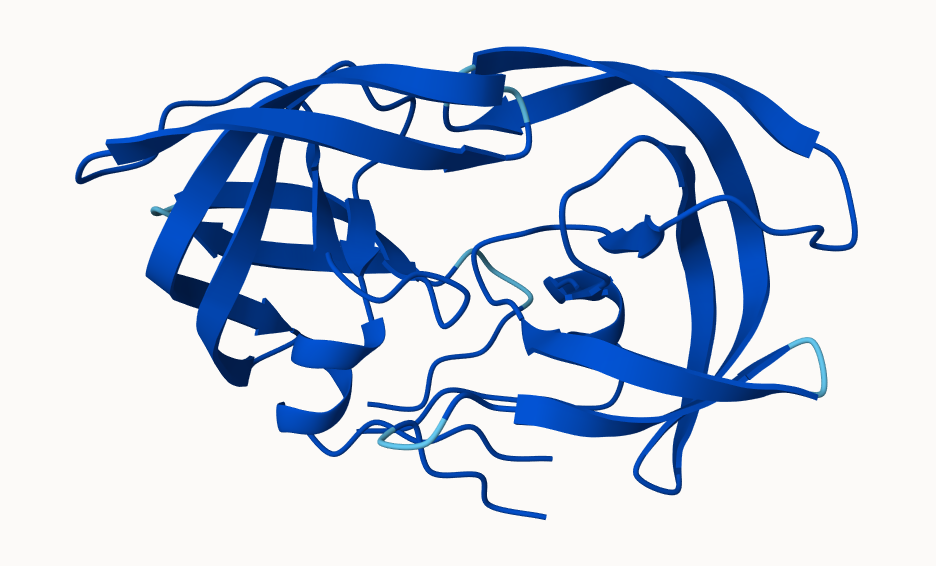
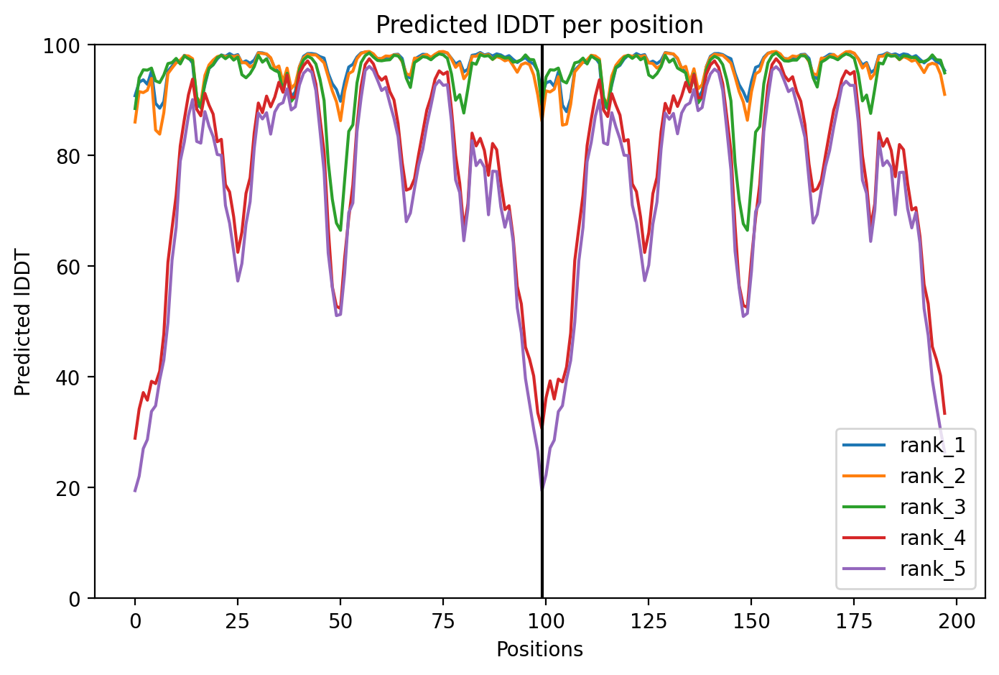
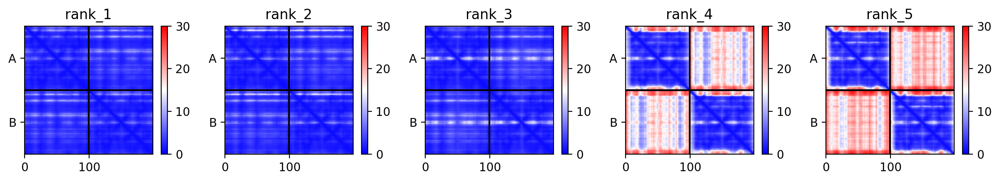

## Background

In this hands-on session we will utilize AlphaFold to predict protein structure from sequence (Jumper et al. 2021).

Without the aid of such approaches, it can take years of expensive laboratory work to determine the structure of just one protein. With AlphaFold we can now accurately compute a typical protein structure in as little as ten minutes.

The PDB database (the main repository of experimental structures) only has **~250 thousand** structures, as we saw in the last lab. The main protein sequence database has **>200 million** sequences! Only 0.125% of known sequences have a known structure. This is called the "structure knowledge gap".

```{r}
250000 / 200000000
```

- Structures are much harder to determine than sequences.
- They are expensive (costing $1M on average).
- They take an average of 3-5 years to solve.

## EBI AlphaFold Database

The EBI has a database of pre-computed AlphaFold (AF) models called AFDB.
This is growing all the time and can be useful to check before running AF ourselves.

## Running AlphaFold

We can download and run locally but we need a GPU. Or we can use "cloud" computing to run this on someone else's computer!

We will use ColabFold <https://github.com/sokrypton/ColabFold>

We previously found there was no AFDB entry for our HIV sequence.

```
>HIV-Pr-Dimer
PQITLWQRPLVTIKIGGQLKEALLDTGADDTVLEEMSLPGRWKPKMIGGIGGFIKVRQYDQILIEICGHKAIGTVLVGPTPVNIIGRNLLTQIGCTLNF:PQITLWQRPLVTIKIGGQLKEALLDTGADDTVLEEMSLPGRWKPKMIGGIGGFIKVRQYDQILIEICGHKAIGTVLVGPTPVNIIGRNLLTQIGCTLNF
```

Here we will use AlphaFold2_mmseqs2.



## Analysis of Resulting Models

Save AlphaFold2 prediction results and import
```{r}
results_dir <- "HIV_23119/" 
```

```{r}
pdb_files <- list.files(path=results_dir,
                        pattern="*.pdb",
                        full.names = TRUE)

# Print our PDB file names
basename(pdb_files)
```

Load bio3d and save top 5 ranked models
```{r}
library(bio3d)
```

```{r}
pdbs <- pdbaln(pdb_files, fit=TRUE, exefile="msa")
pdbs
```
Calculate RMSD between all pairs models:
```{r}
rd <- rmsd(pdbs, fit=T)
range(rd)
```

```{r}
library(pheatmap)
```

Heatmap of pairs models:
```{r}
colnames(rd) <- paste0("m",1:5)
rownames(rd) <- paste0("m",1:5)
pheatmap(rd)
```

```{r}
# reference PDB structure
pdb <- read.pdb("1hsg")
```

Plot the pLDDT values across all models:
```{r}
plotb3(pdbs$b[1,], typ="l", lwd=2, sse=pdb)
points(pdbs$b[2,], typ="l", col="red")
points(pdbs$b[3,], typ="l", col="blue")
points(pdbs$b[4,], typ="l", col="darkgreen")
points(pdbs$b[5,], typ="l", col="orange")
abline(v=100, col="gray")
```



Find most consistent “rigid core” common across all the models:
```{r}
core <- core.find(pdbs)
```

```{r}
core.inds <- print(core, vol=0.5)
```
```{r}
xyz <- pdbfit(pdbs, core.inds, outpath="corefit_structures")
```

RMSF between positions of the structure:
```{r}
rf <- rmsf(xyz)

plotb3(rf, sse=pdb)
abline(v=100, col="gray", ylab="RMSF")
```


## Predicted Alignment Error for domains

```{r}
library(jsonlite)
```

Access Predicted Aligned Error files:
```{r}
pae_files <- list.files(path=results_dir,
                        pattern=".*model.*\\.json",
                        full.names = TRUE)
```

PAE files for Model 1 and 5:
```{r}
pae1 <- read_json(pae_files[1],simplifyVector = TRUE)
pae5 <- read_json(pae_files[5],simplifyVector = TRUE)

attributes(pae1)
```

Plot N by N PAE scores for Model 1:
```{r}
plot.dmat(pae1$pae, 
          xlab="Residue Position (i)",
          ylab="Residue Position (j)")

```

Plot N by N PAE scores for Model 5:
```{r}
plot.dmat(pae5$pae, 
          xlab="Residue Position (i)",
          ylab="Residue Position (j)",
          grid.col = "black",
          zlim=c(0,30))
```

Plot N by N PAE scores for Model 1 again, using the same data range as the plot for model 5:
```{r}
plot.dmat(pae1$pae, 
          xlab="Residue Position (i)",
          ylab="Residue Position (j)",
          grid.col = "black",
          zlim=c(0,30))

```


## Residue conservation from alignment file

```{r}
aln_file <- list.files(path=results_dir,
                       pattern=".a3m$",
                        full.names = TRUE)
aln_file
```

```{r}
aln <- read.fasta(aln_file[1], to.upper = TRUE)
```

Number of sequences in alignment
```{r}
dim(aln$ali)
```

Score residue conservation in the alignment
```{r}
sim <- conserv(aln)
plotb3(sim[1:99], sse=trim.pdb(pdb, chain="A"),
       ylab="Conservation Score")
```

Conserved active sites:
```{r}
con <- consensus(aln, cutoff = 0.9)
con$seq
```

Save a PDB file with an Occupancy column with conservation scores for visualization.
```{r}
m1.pdb <- read.pdb(pdb_files[1])
occ <- vec2resno(c(sim[1:99], sim[1:99]), m1.pdb$atom$resno)
write.pdb(m1.pdb, o=occ, file="m1_conserv.pdb")
```


