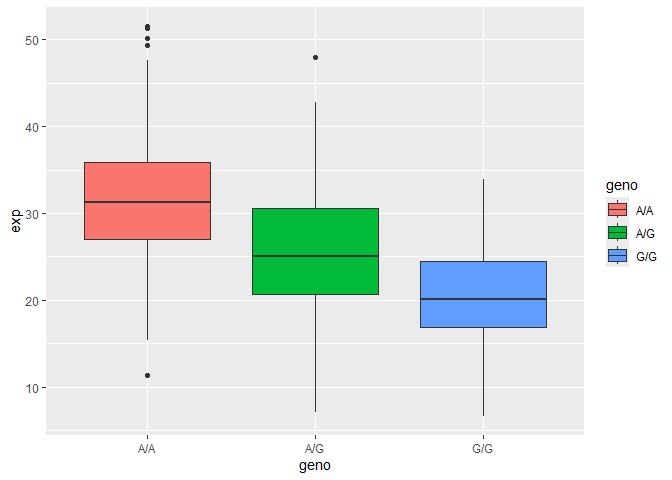

# Class 12, pt. 2: Population Analysis
Aadhya Tripathi (PID: A17878439)

- [Population Scale Analysis](#population-scale-analysis)

## Population Scale Analysis

> Q13. Read this file into R and determine the sample size for each
> genotype and their corresponding median expression levels for each of
> these genotypes.

``` r
# Import the file
results <- read.table("rs8067378_ENSG00000172057.6.txt")
head(results)
```

       sample geno      exp
    1 HG00367  A/G 28.96038
    2 NA20768  A/G 20.24449
    3 HG00361  A/A 31.32628
    4 HG00135  A/A 34.11169
    5 NA18870  G/G 18.25141
    6 NA11993  A/A 32.89721

Gives the sample size of each genotype:

``` r
table(results$geno)
```


    A/A A/G G/G 
    108 233 121 

Calculate the median expression:

``` r
AA <- results[results$geno == "A/A",]
AG <- results[results$geno == "A/G",]
GG <- results[results$geno == "G/G",]

median(AA$exp)
```

    [1] 31.24847

``` r
median(AG$exp)
```

    [1] 25.06486

``` r
median(GG$exp)
```

    [1] 20.07363

A\|A has a sample size of 108 and median expression 31.24847. A\|G has a
sample size of 233 and median expression 25.06486 G\|G has a sample size
of 121 and median expression 20.07363

> Q14. Generate a boxplot with a box per genotype, what could you infer
> from the relative expression value between A/A and G/G displayed in
> this plot? Does the SNP effect the expression of ORMDL3?

Boxplot of the genotype vs expression:

``` r
library(ggplot2)
```

``` r
boxp <- ggplot(results) +
        aes(geno, exp, fill = geno) +
        geom_boxplot()

boxp
```



The G/G genotype decreases expression compared to A/A, based on the
lower median value for G/G. The SNP decreases the expression of ORMDL3.
